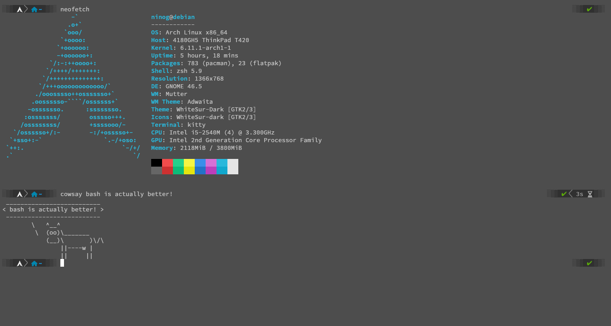

# terminal-configuration 
  
## install script
Download and run the installer
```
wget -O - "https://raw.githubusercontent.com/danielvxsp/terminal-configuration/main/deps.sh" | bash
```  
this script installs zsh, oh-my-zsh, powerlevel10k and moves the config files to the .config directory

## kitty  
install kitty on your system  

https://sw.kovidgoyal.net/kitty/binary/  

---

final product should look like this (hopefully)  




